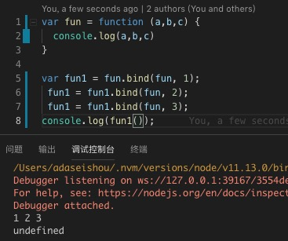

## this、call、apply
#### this
> `this`指向, `this`是根据(函数调用方)执行环境动态绑定,并非函数声明的环境
#### this指向:
- 作为普通函数调用
- 作为构造函数调用
- 通过call、和apply调用
- 作为对象的方法调用(Function.prototype[call|apply])  

#### call、apply
> 用法相同,只是传参不同,`apply`接受一个数组,`call`接受固定数量参数  

`call(target,params) | apply(target,params)` 第一次参数表示函数内部this对象的指向,不需要改变传入null(null可以代替某个具体的对象)

#### bind
[图片上传失败...(./images/1561792013989.jpg)]

> `bind`用来包装一个函数,改变其`this`指向,并返回一个新函数, 并且会记住你传入的参数,直到函数执行